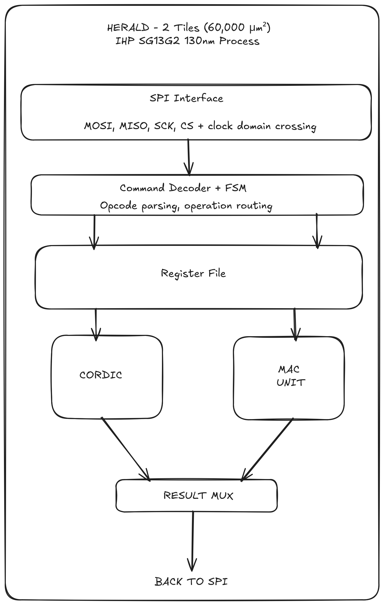

# Herald: Arduino Math Coprocessor

## The Problem

Arduino is some of the most popular choice of beginner embedded systems for millions of makers, students, and hobbyists worldwide. But there's a painful bottleneck: **math performance**.

The Arduino Uno's ATmega328P is an 8-bit AVR microcontroller from 2005 with no floating-point unit. Common mathematical operations that modern applications need are brutally slow.

The result? Projects that should work don't and learning hits artificial limits.

## The Solution: Herald

Herald is a custom silicon math accelerator designed to plug into Arduino and handle the heavy numerical lifting. Think of it as a dedicated math brain that Arduino can offload to.

**Architecture:**
- Arduino sends operation code + data over SPI
- Herald computes in hardware (CORDIC + MAC units)

## What Herald Implements

### Tile 1: CORDIC Engine
A configurable CORDIC (Coordinate Rotation Digital Computer) core that implements:

**Trigonometric operations:**
- `sin(θ)`, `cos(θ)` - simultaneous computation
- `tan(θ)`
- `atan(x)`, `atan2(y, x)`

**Hyperbolic functions:**
- `sinh(x)`, `cosh(x)`, `tanh(x)`

**Vector operations:**
- `sqrt(x)` - square root
- `magnitude(x, y)` - vector length: √(x² + y²)
- Cartesian <-> Polar conversion

**Bonus:**
- Fast multiply (as a CORDIC mode)

### Tile 2: MAC Unit + Interface
**Fast Multiply-Accumulate:**
- `MAC(a, b, c)` -> `a × b + c`
- Enables: dot products, convolution, FIR/IIR filtering

**Communication & Control:**
- SPI interface for Arduino communication
- Command decoder for operation selection
- Result buffering